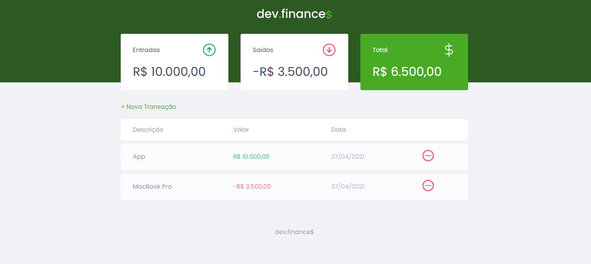

<h1 align="center">
    
</h1>

  

## 💻 Projeto

O dev.finances é uma aplicação de controle financeiro, onde é possível cadastrar e excluir transações e ver o saldo de entrada e saída 💰

## Tecnologias

Esse projeto foi desenvolvido com as seguintes tecnologias:

- HTML
- CSS
- JavaScript

---

Feito com ajuda pela Rocketseat.
